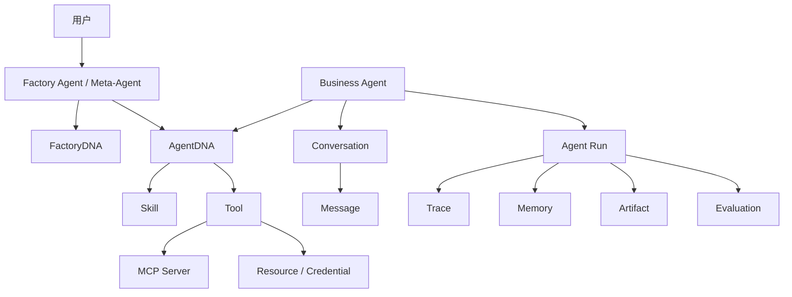
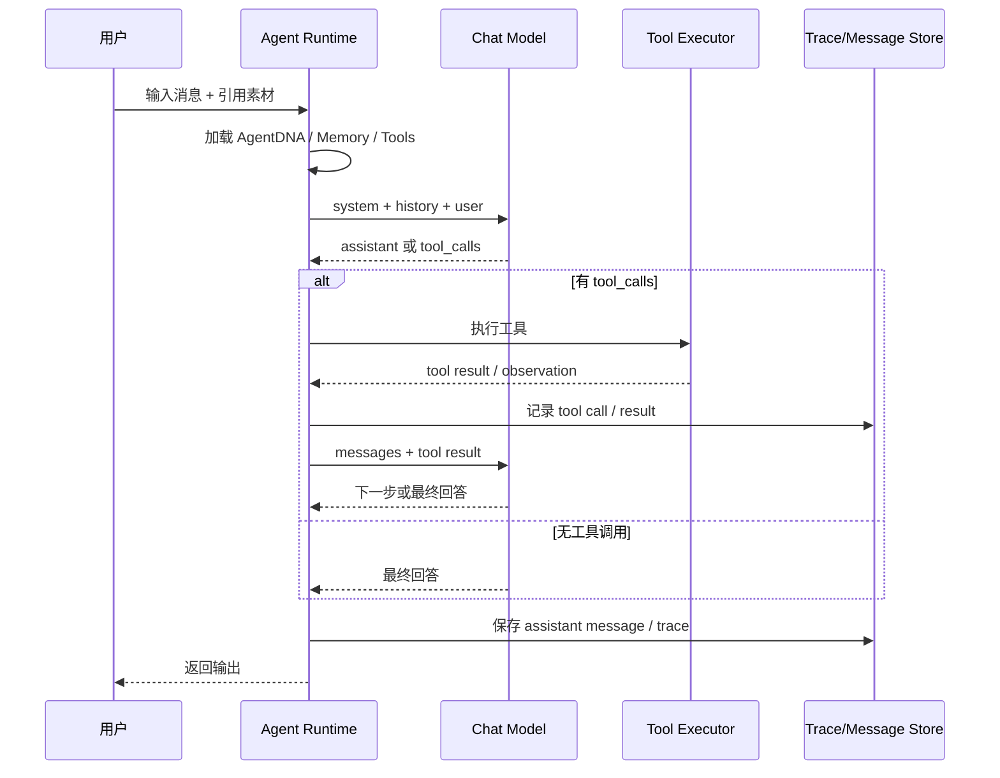

# AgentOS / Agent Factory 重做方案

日期：2026-06-23  
定位：重新设计 AgentOS 与 Agent Factory，不受当前技术栈约束  
目标：把当前项目中已经暴露出的真实需求，整理成一套可重新实现的完整产品与架构方案

## 1. 一句话

AgentOS 不是一个聊天壳，也不是一个 Prompt 表单系统，而是一个面向 Agent 生命周期的创建、配置、测试、运行、观察和进化平台。

Agent Factory 是平台中的 Meta-Agent。它自身也有 FactoryDNA，负责把用户意图转化为可运行、可验证、可迭代的 AgentDNA。

## 2. 当前需求意图提炼

从当前项目与讨论可以看出，你真正想做的是：

1. 用户不用从空白表单开始，而是通过 Agent Factory 描述目标。
2. Agent Factory 作为“创建 Agent 的 Agent”，主动澄清需求、设计 Agent、推荐默认能力、生成可测试配置。
3. 每个业务 Agent 都有自己的 AgentDNA，而不是一堆散落字段。
4. AgentDNA 不只是 prompt，还包括 rules、guidelines、model、skills、tools、memory、reasoning mode、knowledge、evaluation、版本。
5. rules、guidelines、prompt 等最终会编译为 system prompt，但在产品层必须分开管理。
6. skills 是 Agent 的能力与工作方法，tools 是 Agent 可以真实执行的动作。
7. 工具调用必须进入真实 loop，而不是只写在 prompt 里。
8. 模型、工具、知识库、MCP、凭证、素材、会话、记忆都要有清晰边界。
9. 每个 Agent 有自己可用的模型列表，会话中只能在该 Agent 配置的模型中切换。
10. Agent 的输出可以沉淀为素材，素材可在后续会话中引用。
11. Agent 的配置必须版本化，不能覆盖式修改。
12. Factory 要给出测试与发布判断，而不是只生成文本。
13. Factory 自身也应该可配置、可微调、可版本化。
14. MVP 可以先做单 Agent 生命周期，但底层不能做成将来必须推翻的临时架构。

### 2.1 从当前代码反推出的细节需求

当前项目文档并不完整，代码里已经表达出很多更细的产品意图。重做时这些也应被视为需求，而不是实现偶然性。

#### Agent Factory 创建闭环

当前 Factory 不是一个普通创建表单，而是一个“对话澄清 + 候选生成 + DNA 配置 + 测试发布”的工作台：

1. Factory 左侧通过对话澄清需求，右侧以步骤推进：需求澄清、选择候选、配置 DNA、测试发布。
2. Factory 助手回复中包含隐藏的 `agent-suggestions` JSON 代码块，正文给用户看，JSON 给 UI 解析成候选 Agent。
3. 候选 Agent 必须包含 name、description、reason、rules、guidelines、systemPrompt、skills、tools、testCases、evaluationCriteria。
4. 选择候选后，系统会把候选写入 Agent 草稿，并自动推荐 capabilities。
5. 创建 Agent 前必须试跑并得到发布评估；没有 test output 和 evaluation 不能创建，`blocked` 不能发布。
6. Factory 还负责进化建议：收集当前 Agent DNA、最近会话、最近素材，给出 prompt/rule/test/risk 建议。

这说明重做方案里的 Factory 不能退化为“生成一段 prompt 的助手”，它必须是 Agent 生命周期的产品入口。

#### AgentDNA 是配置快照，不是 prompt 字段

代码中 AgentDNA 已经包含：

1. promptVersionId：系统提示词独立版本。
2. modelProfileId：默认模型。
3. modelProfileIds：当前 Agent 可切换模型列表。
4. rules / guidelines：硬约束与软指导。
5. testCases / evaluationCriteria：测试和发布标准。
6. skills / tools：Agent 自己维护的能力绑定，带 source、enabled、reason。
7. skillIds / toolIds / knowledgeBaseIds：为未来 registry / knowledge 绑定保留。
8. reasoningMode：strategy、toolUse、maxIterations、selfCheck、verboseTrace、exposeReasoning。
9. memoryPolicy：短期窗口、长期记忆作用域。

所以重做时 AgentDNA 必须是一等版本对象。保存配置不是覆盖字段，而是生成新的 DNA version；prompt 变化时生成新的 PromptVersion。

#### FactoryDNA 也是 AgentDNA 的同类对象

代码里 FactoryDNA 是系统内置 Meta-Agent 的 singleton version history。它也有 name、icon、description、prompt、rules、guidelines、skills、tools、modelProfileId、reasoningMode、memoryPolicy。

这说明 Agent Factory 不是硬编码页面逻辑，而是一个可设置、可调优、可版本化的 Meta-Agent。重做时 Factory Settings 应该是核心页面，不是附属设置。

#### 模型不是全局一个默认值

当前代码已经表达出三层模型语义：

1. Resource Center 可以维护全局 provider 和 Factory 默认文本模型。
2. 每个业务 Agent 有自己的 modelProfileIds 列表。
3. 会话输入框只能在当前 Agent 配置的模型列表中切换。

Agent-owned provider 可以创建、编辑、删除；如果编辑的是全局 provider，会复制成该 Agent 自己的 provider，避免污染其他 Agent。

这说明“模型供应商”不能只做成全局资源。全局资源是基础设施，AgentDNA 中的模型列表才是运行权限边界。

#### 文本、图像、视频是不同运行分支

runtime 按 provider modality 分流：

1. text：进入 LangChain ChatModel + history + tools + loop。
2. image：调用兼容 `/images/generations` 的图像生成接口，生成后保存为素材。
3. video：调用异步视频任务接口，轮询任务状态，完成后保存为素材。

所以重做时不应把“模型”只理解成聊天模型。模型档案需要包括 modality、baseUrl、modelId、secret、调用协议、任务模式、轮询/回调策略。

#### Tool loop 已经是真实执行，不只是 prompt 描述

当前 runtime 的文本分支已经具备真实 tool loop：

1. AgentDNA 的 tools 决定可加载工具。
2. reasoningMode.toolUse 为 `none` 时不加载工具。
3. `required` 但没有可执行工具时直接报错。
4. runner 将工具 bind 到 LangChain ChatModel。
5. 模型返回 tool calls 后，runtime 执行工具，把 tool result 作为 `tool` message 回给模型。
6. maxIterations 控制最大循环轮数。
7. verboseTrace 为 true 时记录 model_tool_calls、tool_call、tool_result。

这说明重做时 tools 必须是 executable capability，并且 trace、maxIterations、tool policy 都是 AgentDNA 的关键运行参数。

#### Skills 目前是能力说明，Tools 是可执行动作

代码中的 skills 主要进入 system prompt，表达“这个 Agent 擅长什么、应采用什么方法”。tools 则通过 runtime 被加载为可执行工具。目前内置可执行工具是：

1. `read_artifact`：读取当前消息引用素材或指定素材。
2. `summarize_text`：对长文本做截断式摘要。

`web_search` 已在推荐 catalog 中出现，但当前尚未接入 executor。重做时要明确区分：

1. Skill catalog：方法论和工作能力。
2. Tool registry：可执行动作。
3. Tool binding：当前 Agent 被允许使用哪些工具。
4. Tool executor：真正执行工具的代码、MCP、HTTP 或 workflow。

#### 素材 Artifact 是工作资产，不是普通附件

代码中 Artifact 有 agentId、conversationId、messageId、sourceAgentDeleted、content/fileUrl/thumbnailUrl 等血缘字段。删除行为也体现出产品语义：

1. 删除会话：素材保留，只清空 conversationId/messageId。
2. 删除 Agent：素材保留，断开 agent/conversation/message 来源，并标记 sourceAgentDeleted。
3. 从素材库删除：不是物理删除，而是断开当前 Agent 归属。
4. 图像/视频生成后自动保存为素材。
5. 聊天中可 `@素材` 引用，引用素材会作为上下文进入 runtime。

这说明素材是 AgentOS 的长期工作资产，也是记忆、上下文、测试样例和进化信号的来源。

#### 会话体验有明确工作台语义

当前首页不是 landing page，而是三栏 workbench：

1. 左侧 sidebar：Agent 列表、当前 Agent 会话列表、新建会话、Agent 设置、删除。
2. 中间 chat：当前 Agent 的对话、模型切换、素材引用、上传、编辑重发、复制、保存输出。
3. 右侧 artifact panel：素材库，可按 Agent 过滤，可预览、下载、删除。

UI 偏向“长期使用的生产工作台”，不是一次性 demo 聊天页。

#### 消息编辑与重放是运行语义

用户消息支持编辑重发。runtime 处理方式是：

1. 只能编辑当前会话中的 user message。
2. 编辑后删除该消息之后的旧回复和后续消息。
3. 与旧消息关联的素材断开 conversation/message 来源。
4. 新回复重新生成并落库。

这说明重做时要把 regenerate / replace message 当作一等运行能力，不能只做前端文本替换。

#### 可观察过程分两层

当前 UI 有 ResponseProcessPanel，用于展示“文本/图像/视频生成过程”的用户可见步骤；runtime 也有 verboseTrace，用于记录 tool loop trace。

重做时需要区分：

1. User-facing progress：告诉用户现在正在理解、调用模型、生成素材、保存素材。
2. Developer/operator trace：记录模型调用、工具调用、参数、结果、token、错误。

不应暴露隐藏推理链，但应暴露可审计执行过程。

#### Resource Center 是基础设施，不是 Agent 能力本身

当前 Resource Center 管理 provider、api_key、skill、tool、knowledge_base，并处理密钥加密、provider preset、Factory 默认模型、删除前依赖检查。

但业务 Agent 的 skills/tools 已经改为 AgentDNA 自己维护，不再从资源凭证中直接读取。重做时应保持这个边界：

1. Resource Center：全局基础能力、凭证、连接、注册表。
2. Agent Settings：当前 Agent 的模型、skills、tools、knowledge 绑定和权限。
3. Factory：根据需求推荐默认绑定，但需要用户确认。

#### 本地 UI 偏好也是产品行为

store 中持久化了 currentAgentId、currentConversationId、sidebarCollapsed、artifactPanelOpen、artifactPanelWidth、factoryPanelWidth、artifactView。

这说明重做时不要只设计数据实体，也要设计工作台状态：用户会长期使用同一个 Agent、同一组会话和素材面板，布局记忆会影响生产效率。

## 3. 外部参考框架分析

### 3.1 AgentScope

AgentScope 2.0 强调生产可用的 Agent 框架，核心能力包括事件系统、权限系统、多租户多会话服务、workspace / sandbox、可扩展 middleware，并倾向利用模型自身推理和工具使用能力，而不是过度固定编排。

对本项目的启发：

1. Agent 运行时要有事件系统，UI 才能看到“正在调用工具、得到观察、进入下一步”。
2. 工具和资源必须有权限系统，不能只靠 prompt 约束。
3. 工具执行需要 sandbox，尤其是文件、代码、浏览器、MCP 工具。
4. Reasoning-Acting loop 应该是可插拔 middleware，而不是写死在一个 route 里。

适合借鉴的概念：

- Event bus
- Permission system
- Multi-session runtime
- Workspace / sandbox
- Middleware around reasoning-action loop

参考：[AgentScope GitHub](https://github.com/agentscope-ai/agentscope)

### 3.2 AutoGen / Microsoft Agent Framework

AutoGen 是多 Agent 应用框架，但当前 AutoGen 仓库已进入 maintenance mode，并建议新项目转向 Microsoft Agent Framework。AutoGen 的价值在于它较早系统化了 multi-agent、AgentChat、Studio、团队协作、人在回路、工具执行和多 Agent 对话。

对本项目的启发：

1. 要区分底层 agent runtime、上层 agent chat API、可视化 studio。
2. Factory UI 不应该直接等同于 runtime；它是一个 Studio / Builder 层。
3. 多 Agent 不是第一阶段重点，但架构上要保留 handoff / team / supervisor 空间。
4. 人在回路不是附加项，而是 Agent 平台的安全边界。

适合借鉴的概念：

- AgentChat 高层 API
- Core runtime 与 UI Studio 分离
- Multi-agent team
- Human-in-the-loop
- Agent handoff

参考：[AutoGen GitHub](https://github.com/microsoft/autogen)

### 3.3 CrewAI

CrewAI 的核心抽象更产品化：Agent、Task、Crew、Flow。它强调 role / goal / backstory、tools、memory、guardrails、task dependencies、structured output 和 human review。

对本项目的启发：

1. Agent 不应该只有 prompt，需要明确 role、goal、backstory / identity。
2. Task 是非常重要的抽象。当前项目只做会话，但后续测试、发布、评估、素材生成都应该任务化。
3. CrewAI 的 Flow 提醒我们：工作流不一定一开始就是多 Agent，单 Agent 的生命周期也可以是 flow。
4. structured output 和 human review 应该成为 AgentDNA 的一部分。

适合借鉴的概念：

- Agent role / goal / backstory
- Task description / expected output
- Crew / Flow separation
- Guardrails
- Human review
- Structured output

参考：[CrewAI GitHub](https://github.com/crewAIInc/crewAI)

### 3.4 LangGraph

LangGraph 是低层状态图编排框架，强调 long-running、stateful、durable execution、human-in-the-loop、memory、debugging、deployment 和 LangSmith observability。

对本项目的启发：

1. Agent 执行不是一次 HTTP 请求，而是有状态 run。
2. Tool calling loop、ReAct、Plan-Execute、Review 都适合建模成 graph。
3. 状态应该显式化，不应隐含在 messages 数组里。
4. durable execution 对长任务、视频生成、文件处理、多步工具调用很关键。
5. 调试和观测需要看 state transitions，而不是只看最后回答。

适合借鉴的概念：

- State graph
- Durable execution
- Checkpoint
- Interrupt / resume
- Human-in-the-loop
- Execution trace
- Long-running run

参考：[LangGraph GitHub](https://github.com/langchain-ai/langgraph)

### 3.5 Dify

Dify 是更接近本项目产品形态的 LLM 应用平台，包含 workflow、RAG pipeline、agent capabilities、model management、observability、prompt IDE、工具和 API 发布。

对本项目的启发：

1. Agent Factory 不只是开发者工具，也应该是一套 LLMOps 平台。
2. 模型管理、Prompt IDE、RAG、工具、日志观测要在一个产品体系里。
3. Function Calling 和 ReAct 可以作为 Agent 策略，而不是互斥产品线。
4. 应该把生产数据、日志、人工标注反馈到 prompt、dataset、model 和 eval。

适合借鉴的概念：

- Prompt IDE
- Model provider management
- RAG pipeline
- Agent strategies: Function Calling / ReAct
- LLMOps logs and annotations
- Workflow as API / backend service

参考：[Dify GitHub](https://github.com/langgenius/dify)

### 3.6 Langflow / Flowise

Langflow 和 Flowise 更偏视觉化编排。Langflow 强调 visual authoring、playground、API / JSON export、workflow as MCP server、observability、MCP server。Flowise 强调低代码构建 AI Agents 和 LLM workflows。

对本项目的启发：

1. 视觉化不应该一开始就替代 AgentDNA 表单，但后续可以作为 workflow / tool graph 编辑器。
2. 每个 workflow / Agent 能导出为 JSON / API / MCP tool 是很重要的可复用方向。
3. Playground 必须能 step-by-step 调试 Agent，而不是只能聊天。
4. 安全隔离非常重要，尤其用户可自定义工具或 MCP 节点时。

适合借鉴的概念：

- Visual authoring
- Playground
- Workflow export
- Workflow as tool / MCP server
- Observability integration

参考：[Langflow GitHub](https://github.com/langflow-ai/langflow)、[Flowise GitHub](https://github.com/FlowiseAI/Flowise)

### 3.7 OpenAI Agents SDK

OpenAI Agents SDK 的抽象很清楚：Agents 是带 instructions、tools、guardrails、handoffs 的 LLM；tools 可以是函数、MCP、hosted tools；还有 sessions、tracing、human-in-the-loop、guardrails。

对本项目的启发：

1. AgentDNA 里应显式包含 instructions、tools、guardrails、handoffs、sessions、tracing 配置。
2. Handoff 可以先不做，但抽象上要预留。
3. Trace 是一等对象，不是日志字符串。
4. Guardrails 应该独立于 prompt 存在。

适合借鉴的概念：

- Agent = instructions + tools + guardrails + handoffs
- Sessions
- Tracing
- Hosted tools / function tools / MCP tools
- Input and output guardrails

参考：[OpenAI Agents SDK GitHub](https://github.com/openai/openai-agents-python)

## 4. 重做时的产品定位

建议重新定义为：

> AgentOS 是一个面向个人或团队的 Agent 生命周期平台。它通过一个可配置的 Agent Factory，把用户意图转化为可运行、可测试、可发布、可观察、可迭代的 Agent。

不要把它定位成：

1. 普通聊天机器人平台。
2. 单纯 prompt 管理器。
3. 一开始就做复杂多 Agent workflow 的平台。
4. 只给开发者用的 LangChain 可视化壳。

应该优先做：

1. 单 Agent 生命周期闭环。
2. AgentDNA / FactoryDNA 的可配置和版本化。
3. Tool calling loop 和可观察 trace。
4. 资源、工具、模型、素材、记忆、评估的清晰边界。
5. 后续自然演进到 workflow、多 Agent、MCP 生态。

## 5. 核心领域模型



## 6. AgentDNA

AgentDNA 是业务 Agent 的完整配置快照。它不是数据库里的若干字段拼接，而是可版本化的 Agent 工作协议。

### 6.1 AgentDNA 字段

```text
AgentDNA
├── identity
│   ├── name
│   ├── icon/avatar
│   ├── role
│   ├── responsibility
│   └── boundaries
├── instructions
│   ├── systemPrompt
│   ├── rules
│   ├── guidelines
│   ├── outputContract
│   └── examples
├── model
│   ├── defaultModelProfileId
│   ├── allowedModelProfileIds
│   ├── temperature
│   ├── maxTokens
│   └── modality
├── capabilities
│   ├── skills
│   ├── tools
│   ├── knowledgeBases
│   └── mcpServers
├── reasoning
│   ├── mode
│   ├── maxIterations
│   ├── toolUsePolicy
│   ├── selfCheck
│   └── verboseTrace
├── memory
│   ├── shortTermPolicy
│   ├── longTermPolicy
│   ├── userPreferencePolicy
│   └── artifactMemoryPolicy
├── guardrails
│   ├── inputGuardrails
│   ├── outputGuardrails
│   ├── toolPermissionPolicy
│   └── sensitiveActionPolicy
├── evaluation
│   ├── testCases
│   ├── acceptanceCriteria
│   ├── regressionSuite
│   └── scoringRubric
└── version
    ├── versionNumber
    ├── status
    ├── changeNote
    └── createdBy/createdAt
```

### 6.2 Prompt、Rules、Guidelines 的定位

这些字段最终大多会编译进 system prompt，但产品语义必须拆开：

1. systemPrompt：身份、职责、任务框架。
2. rules：硬约束，违反即失败。
3. guidelines：软指导，影响风格和优先级。
4. outputContract：结构化输出协议。
5. examples：少样本示例和边界示例。

编译结果示例：

```text
System Prompt:
你是一个小说内容分析 Agent...

Rules:
1. 不改写原文事实
2. 不输出视频生成结果，只做分析

Guidelines:
1. 优先使用简体中文
2. 输出尽量结构化

Output Contract:
必须输出 summary / hooks / risks / materialSuggestions

Skills:
...

Available Tools:
...

Reasoning Mode:
...
```

## 7. FactoryDNA

FactoryDNA 是 Agent Factory 自身的配置。Factory 是系统内置 Meta-Agent，不应该混入用户创建的业务 Agent 列表。

### 7.1 FactoryDNA 字段

```text
FactoryDNA
├── name
├── icon
├── description
├── prompt
├── rules
├── guidelines
├── skills
│   ├── requirement_clarification
│   ├── agent_design
│   ├── capability_selection
│   ├── test_case_design
│   ├── publish_evaluation
│   └── evolution_advice
├── tools
│   ├── read_resource_catalog
│   ├── inspect_model_profiles
│   ├── recommend_skills_tools
│   ├── draft_agent_dna
│   ├── run_draft_agent
│   ├── evaluate_run
│   └── save_agent_dna
├── model
├── reasoningMode
├── memoryPolicy
├── guardrails
└── versionHistory
```

### 7.2 Factory 的权限边界

Factory 可以：

1. 澄清需求。
2. 生成 Agent 草稿。
3. 推荐 skills / tools / knowledge / model。
4. 运行测试。
5. 给出发布判断。
6. 给出进化建议。

Factory 不可以：

1. 未经用户确认直接发布 Agent。
2. 未经用户确认绑定高风险工具。
3. 未经用户确认修改已发布 Agent 的核心 rules。
4. 虚构不存在的工具或知识库。
5. 静默扩大 Agent 权限。

## 8. Skills 与 Tools

### 8.1 Skill

Skill 是能力、方法论、流程经验或专门任务策略。

Skill 不一定可执行。它可能只是告诉 Agent 如何工作，也可能绑定一组 tools。

```text
Skill
├── id
├── name
├── description
├── instructions
├── expectedInputs
├── expectedOutputs
├── recommendedTools
├── examples
├── constraints
└── version
```

示例：

1. 小说短视频适配。
2. 内容结构化分析。
3. Prompt 评审。
4. 发布评估。
5. 长文本摘要。

### 8.2 Tool

Tool 是可执行动作。模型可以请求调用，Runtime 负责执行。

```text
Tool
├── id
├── name
├── description
├── inputSchema
├── outputSchema
├── executorType
│   ├── builtin
│   ├── http
│   ├── mcp
│   ├── workflow
│   └── agent
├── permissionPolicy
├── timeout/retry
├── sandboxPolicy
└── version
```

Tool 类型：

1. Built-in tool：读取素材、保存素材、总结文本。
2. HTTP tool：调用外部 API。
3. MCP tool：通过 MCP Server 暴露的工具。
4. Workflow tool：一个 workflow 发布为工具。
5. Agent as tool：另一个 Agent 被当前 Agent 调用。

## 9. MCP

MCP 是外部工具和上下文的标准接入层。

在重做设计中，MCP 不应该只是“资源与凭证”里的一个类型，而应该是一等集成对象：

```text
MCP Server
├── id
├── name
├── transport
│   ├── stdio
│   ├── http
│   └── sse/streamable-http
├── tools
├── resources
├── prompts
├── auth
├── permissionPolicy
├── healthStatus
└── auditLogs
```

MCP 的使用流程：

1. 管理员或用户添加 MCP Server。
2. 系统发现 MCP tools / resources / prompts。
3. Factory 根据 Agent 目标推荐可用 MCP tools。
4. 用户确认绑定。
5. Runtime 执行 tool call 时通过 MCP Client 调用。
6. Trace 记录 tool call、参数、结果和错误。

## 10. Reasoning Mode

思考模式是应用层执行策略，不是模型标准字段。建议内置以下模式：

| 模式 | 用途 | 行为 |
| --- | --- | --- |
| direct | 简单问答 | 不主动规划，不强制工具 |
| clarify_first | 需求不清楚 | 先问澄清问题 |
| plan_then_answer | 复杂任务 | 先内部规划，再输出 |
| tool_first | 需要上下文 | 优先判断是否调用工具 |
| react | 多步执行 | 判断、行动、观察、继续 |
| plan_execute_review | 高价值任务 | 规划、执行、复核、输出 |
| human_approval | 高风险任务 | 关键步骤等待人工确认 |

MVP 可以保留前 5 个。后续加入 `plan_execute_review` 和 `human_approval`。

## 11. Runtime 与 Loop

Runtime 是 Agent 真正执行的地方。它不是简单调用模型，而是运行一个 Agent Run。

### 11.1 Agent Run

```text
AgentRun
├── id
├── agentId
├── agentDnaVersion
├── conversationId
├── input
├── state
├── messages
├── toolCalls
├── observations
├── artifacts
├── trace
├── status
├── error
├── startedAt
└── finishedAt
```

### 11.2 Tool Calling Loop



### 11.3 Loop 控制

每个 AgentDNA 必须配置：

1. maxIterations。
2. timeout。
3. allowedTools。
4. toolUsePolicy。
5. retryPolicy。
6. stopCondition。
7. humanApprovalPolicy。

必须防止：

1. 无限循环。
2. 工具重复调用。
3. 高风险工具静默执行。
4. tool result 太大撑爆上下文。
5. 模型幻觉不存在的工具。

## 12. Graph Orchestration

重做时建议把 Runtime 设计成 Graph-first，而不是 route-first。

MVP 可以先内置几种图：

### 12.1 Chat Tool Calling Graph

```text
load_context -> model -> tools? -> model -> final -> persist
```

### 12.2 Factory Create Agent Graph

```text
clarify_requirement -> draft_agent_dna -> recommend_capabilities -> test_run -> evaluate -> user_confirm -> publish
```

### 12.3 Evolve Agent Graph

```text
collect_signals -> diagnose_failures -> propose_dna_change -> regression_test -> user_confirm -> publish_new_version
```

### 12.4 Media Generation Graph

```text
validate_prompt -> submit_task -> poll_status -> save_artifact -> notify_user
```

初期不一定要引入某个特定框架，但架构概念应是：

1. 节点有明确输入输出。
2. 状态显式存储。
3. 支持中断和恢复。
4. 支持 trace。
5. 支持人工审批节点。

## 13. Memory

Memory 不应该只是一段历史消息窗口。

建议分层：

```text
Memory
├── Conversation Memory
│   ├── recent messages
│   └── conversation summary
├── Agent Memory
│   ├── agent-specific facts
│   ├── successful examples
│   └── recurring corrections
├── User Preference Memory
│   ├── language preference
│   ├── output style
│   └── domain preference
├── Artifact Memory
│   ├── saved outputs
│   ├── source lineage
│   └── reusable examples
└── Evaluation Memory
    ├── failed test cases
    ├── regression examples
    └── accepted outputs
```

Memory 写入必须有策略：

1. 自动写入低风险摘要。
2. 高价值事实建议用户确认。
3. 用户保存素材视为强反馈。
4. 用户修改 prompt / rules 视为进化信号。
5. 失败 trace 进入评估记忆，不进入普通上下文。

## 14. Evaluation

AgentOS 应该把 evaluation 作为一等能力，而不是后补页面。

### 14.1 Evaluation 对象

```text
Evaluation
├── testCase
├── input
├── expectedBehavior
├── actualOutput
├── criteria
├── judge
│   ├── heuristic
│   ├── llm_judge
│   └── human
├── score
├── verdict
└── traceRef
```

### 14.2 发布判断

发布前至少检查：

1. 是否完成目标。
2. 是否遵守 rules。
3. 输出结构是否稳定。
4. 是否使用了必要工具。
5. 是否产生幻觉。
6. 是否越权。
7. 错误处理是否可接受。

### 14.3 回归测试

每个 AgentDNA 新版本发布前，应运行：

1. 当前测试样例。
2. 历史失败样例。
3. 用户保存的高价值样例。
4. Factory 建议新增样例。

## 15. Observability / Trace

Trace 是 Agent 平台的核心资产。

```text
Trace
├── runId
├── agentId
├── dnaVersion
├── modelCalls
├── prompts
├── toolCalls
├── toolResults
├── observations
├── stateTransitions
├── tokenUsage
├── latency
├── errors
└── humanActions
```

UI 应展示：

1. 模型调用。
2. 工具调用。
3. 工具参数。
4. 工具结果摘要。
5. 轮数。
6. 错误。
7. 最终输出。

不应展示完整隐藏推理链，但可以展示可观察执行过程。

## 16. 资源与凭证

资源中心应该管理平台基础能力，但 AgentDNA 应保存引用和绑定快照。

```text
Resource Center
├── Model Providers
├── API Keys / Secrets
├── Tool Registry
├── Skill Registry
├── MCP Servers
├── Knowledge Bases
├── Sandboxes
└── Resource Policies
```

关键原则：

1. Agent 不持有明文密钥。
2. AgentDNA 保存资源引用和能力绑定。
3. 工具权限按 Agent 粒度控制。
4. Factory 可以推荐资源，但用户确认后才绑定。
5. 删除资源前检查依赖。

## 17. 素材 Artifact

Artifact 是 AgentOS 的核心产物，不是普通附件。

```text
Artifact
├── id
├── type
├── name
├── content/file
├── source
│   ├── agentId
│   ├── conversationId
│   ├── messageId
│   └── runId
├── lineage
├── metadata
├── savedByUser
├── reusableAsContext
└── status
```

原则：

1. Agent 输出不自动成为素材。
2. 用户保存才成为素材。
3. 素材可被 `@素材` 引用。
4. 素材保留来源血缘。
5. 删除 Agent 不应物理删除已保存素材。
6. 素材可反哺测试样例和 Agent 进化。

## 18. 页面与产品模块

### 18.1 Agent Factory

职责：

1. 对话式需求澄清。
2. 生成候选 Agent。
3. 生成 AgentDNA 草稿。
4. 推荐模型、skills、tools、knowledge、memory、reasoning mode。
5. 运行测试。
6. 给出发布判断。
7. 创建 Agent。

页面结构：

```text
Agent Factory
├── 左侧对话区
├── 候选 Agent 列表
├── AgentDNA 草稿编辑区
├── 测试运行区
├── 发布判断区
└── Factory trace 区
```

### 18.2 Factory Settings

职责：

1. 配置 FactoryDNA。
2. 查看 FactoryDNA 版本历史。
3. 选择 Factory 默认模型。
4. 配置 Factory skills / tools / reasoning mode。
5. 配置 Factory 的 guardrails 和权限边界。

### 18.3 Agent Workspace

职责：

1. 当前 Agent 对话。
2. 模型切换。
3. 素材引用。
4. 输出保存为素材。
5. 查看执行 trace。
6. 会话管理。

### 18.4 Agent Settings

职责：

1. 编辑 AgentDNA。
2. 管理 prompt / rules / guidelines。
3. 管理模型列表。
4. 管理 skills / tools / MCP / knowledge。
5. 管理 memory / reasoning mode。
6. 管理测试样例。
7. 管理版本历史。

### 18.5 Resource Center

职责：

1. 模型 provider。
2. API key / secret。
3. MCP server。
4. tool registry。
5. skill registry。
6. knowledge base。
7. sandbox。
8. 权限策略。

### 18.6 Run Monitor

职责：

1. 查看 Agent run。
2. 查看 trace。
3. 查看失败工具调用。
4. 查看耗时和 token。
5. 复现某次 run。
6. 将失败 run 转为测试样例。

MVP 可以先不做完整 Run Monitor，但数据模型必须保留。

## 19. 数据模型建议

```text
users
agents
agent_dna_versions
factory_dna_versions
conversations
messages
agent_runs
run_steps
tool_calls
artifacts
resources
secrets
skills
tools
mcp_servers
knowledge_bases
memories
evaluations
test_cases
permissions
audit_logs
```

### 19.1 关键关系

1. Agent -> many AgentDNA versions。
2. Agent -> many Conversations。
3. Conversation -> many Messages。
4. Message -> many Artifact refs。
5. AgentRun -> many RunSteps。
6. RunStep -> model call / tool call / human action。
7. AgentDNA -> many skill/tool/resource bindings。
8. FactoryDNA -> system singleton version history。
9. Artifact -> source Agent / Conversation / Message / Run。

## 20. 权限与安全

必须从第一天设计：

1. Secret 永不进入 AgentDNA 明文字段。
2. Tool 有权限等级。
3. 高风险 tool 需要用户确认。
4. MCP Server 需要 sandbox 和 allowlist。
5. 文件、代码、浏览器工具需要独立 workspace。
6. 工具参数和结果要审计。
7. Agent 不能调用未绑定工具。
8. Factory 不能静默扩大 Agent 权限。
9. 多租户隔离要预留。
10. 删除行为要有软删除和血缘保留策略。

## 21. 推荐实现路线

### Phase 0：概念定版

目标：先定清楚领域模型。

产物：

1. AgentDNA spec。
2. FactoryDNA spec。
3. Tool / Skill / MCP spec。
4. AgentRun / Trace spec。
5. Memory / Evaluation spec。

### Phase 1：单 Agent 生命周期 MVP

目标：完成 Define -> Compose -> Test -> Publish -> Use。

能力：

1. Factory 对话创建 Agent。
2. AgentDNA 编辑和版本化。
3. per-Agent 模型列表。
4. skills / tools 绑定。
5. Tool calling loop。
6. 素材保存和引用。
7. Factory 发布判断。

### Phase 2：观察和进化

目标：从真实使用中改进 Agent。

能力：

1. Trace UI。
2. Run history。
3. 失败 run 转测试样例。
4. Factory evolve 建议。
5. AgentDNA regression test。
6. Memory 策略增强。

### Phase 3：MCP 与工具生态

目标：开放外部工具接入。

能力：

1. MCP Server 管理。
2. Tool discovery。
3. Tool permission。
4. Sandbox。
5. Workflow as tool。
6. Agent as tool。

### Phase 4：Workflow / Multi-Agent

目标：从单 Agent 生命周期升级为多 Agent 编排。

能力：

1. Graph runtime。
2. Supervisor。
3. Handoff。
4. Multi-agent team。
5. Human approval node。
6. Durable execution。
7. Visual graph editor。

## 22. 技术架构建议

不绑定具体技术栈，但建议分层：

```text
Frontend Studio
├── Agent Factory UI
├── Agent Workspace
├── Settings
├── Resource Center
└── Run Monitor

Application API
├── Agent Management
├── Factory Management
├── Resource Management
├── Artifact Management
├── Evaluation Management
└── Run Query

Agent Runtime
├── Graph Runner
├── Tool Calling Loop
├── Model Gateway
├── Tool Executor
├── MCP Client
├── Memory Manager
├── Trace Recorder
└── Guardrail Engine

Storage
├── Relational DB
├── Object Storage
├── Vector Store
├── Secret Store
└── Event / Queue
```

## 23. 关键设计决策

1. Factory 是 Meta-Agent，不混入业务 Agent 列表。
2. FactoryDNA 和 AgentDNA 都必须版本化。
3. Skills 和 Tools 分开。
4. Tools 必须真实可执行，并进入 loop。
5. MCP 是工具接入层，不是 prompt 概念。
6. Memory 分层管理。
7. Trace 是一等数据对象。
8. Eval 是发布前必须环节。
9. Resource Center 管理底层能力，AgentDNA 管理绑定关系。
10. MVP 不做多 Agent，但 Runtime 设计为 graph-ready。

## 24. 不建议做的事

1. 不要把所有配置揉成一个 prompt textarea。
2. 不要把 skills / tools 只做成标签。
3. 不要让 Agent 随便调用全局工具。
4. 不要把 Factory 当普通页面表单。
5. 不要一开始做复杂多 Agent workflow。
6. 不要忽略 trace 和 evaluation。
7. 不要把资源凭证和 AgentDNA 混在一起。
8. 不要让模型 provider 只有一个全局默认。
9. 不要无版本覆盖 Agent 配置。
10. 不要让视觉 workflow 先于领域模型出现。

## 25. 最终建议

如果重新做，建议从一开始就把系统命名为：

```text
AgentOS
  - Agent Factory: 创建和进化 Agent 的 Meta-Agent
  - Agent Studio: 配置和测试 AgentDNA
  - Agent Workspace: 使用 Agent
  - Resource Center: 管理模型、工具、MCP、知识和凭证
  - Runtime: 执行 Agent Run
  - Observatory: 查看 trace、评估和进化信号
```

第一阶段只做单 Agent，但要按完整生命周期设计：

```text
Define -> Compose -> Test -> Publish -> Use -> Observe -> Evolve
```

这样既能控制 MVP 范围，又不会把底座做成将来无法承载 MCP、工具市场、长期记忆、评估、Graph Runtime、多 Agent 的临时系统。

## 26. 当前代码证据索引

这部分不是为了限制重做方案的技术选型，而是说明上面的需求不是凭空推断。

### 26.1 领域模型与版本

1. `packages/db/src/schema.ts`
   - `agents`：业务 Agent 主体，支持 status、currentDnaId、soft delete。
   - `prompt_versions`：Prompt 独立版本。
   - `agent_dnas`：AgentDNA 版本快照，包含模型、rules、guidelines、skills、tools、reasoningMode、memoryPolicy。
   - `factory_dnas`：FactoryDNA singleton version history。
   - `messages`：role 支持 `user / assistant / system / tool`，内容支持 text、tool-call、tool-result、artifact-ref。
   - `artifacts`：素材有来源血缘，并支持 sourceAgentDeleted。
   - `agent_memory`、`audit_logs`：说明长期记忆和审计已经被预留。

2. `packages/shared/src/schemas.ts`
   - 定义 AgentDNA 输入结构、reasoningMode、memoryPolicy、Agent capability binding。
   - 定义 Agent-owned model provider 的创建、更新、删除 schema。

3. `packages/shared/src/factory-dna.ts`
   - 定义 DEFAULT_FACTORY_DNA、Factory skills/tools、FactoryDNA prompt 渲染。
   - 说明 Factory 是可配置 Meta-Agent，不是硬编码流程。

4. `packages/shared/src/capabilities.ts`
   - 定义默认 skill/tool catalog 和基于需求文本的推荐逻辑。
   - 说明 Factory 创建 Agent 时应自动推荐默认能力。

### 26.2 Factory 工作流

1. `apps/web/src/app/factory/page.tsx`
   - 对话澄清、候选列表、DNA 草稿、测试发布四步工作台。
   - 解析 `agent-suggestions` 隐藏 JSON 块。
   - 创建前强制 test run + evaluation。
   - 保存 Agent 时写入 rules、guidelines、prompt、skills、tools、testCases、evaluationCriteria、模型绑定。

2. `apps/runtime/src/routes/factory.ts`
   - `/factory/chat`：Factory 无状态澄清和候选 Agent 生成。
   - `/test-run`：草稿 Agent 一次性试跑。
   - `/test-evaluate`：发布评估，返回 publishable / needs_changes / blocked。
   - `/factory/evolve`：根据真实会话和素材信号生成进化建议。

3. `apps/web/src/app/factory/settings/page.tsx`
   - FactoryDNA 设置入口，说明 Factory 自身可微调。

### 26.3 Agent 设置与 AgentDNA 管理

1. `apps/web/src/app/agents/[id]/page.tsx`
   - Agent 设置页 tab：基础信息、Prompt 版本、模型与绑定、记忆策略、发布与删除。
   - 支持 Agent-owned model provider 增删改。
   - 支持 rules、guidelines、prompt、skills、tools、knowledge、reasoningMode、memoryPolicy。
   - 支持从真实使用信号触发 evolve 建议。

2. `apps/web/src/server/routers/agent.ts`
   - `create`：创建 Agent + 初始 PromptVersion + 初始 AgentDNA。
   - `updateDna`：每次保存生成新 DNA version，prompt 变化生成新 PromptVersion。
   - `restorePromptVersion`：恢复历史 Prompt 时生成新的当前版本。
   - `createModelProvider / updateModelProvider / deleteModelProvider`：Agent 自己维护模型列表。
   - `delete`：软删除 Agent，删除会话，保留素材并断开来源。

### 26.4 Runtime 与工具循环

1. `apps/runtime/src/routes/chat.ts`
   - 校验所选模型必须属于当前 Agent 的模型列表。
   - buildSystemPrompt 把 prompt、rules、guidelines、skills、tools、reasoningMode 编译为 system prompt。
   - 文本模型走 history + artifact context + tool loop。
   - 图像/视频模型走生成分支并自动保存素材。
   - 支持消息编辑重发，删除旧回复和旧后续消息。

2. `apps/runtime/src/agent-runner.ts`
   - `buildAgentPrompt`：生成 system/history/user 消息。
   - `runAgentTurn`：有工具时进入 `runToolLoop`，无工具时直接流式调用模型。
   - `runToolLoop`：执行 model -> tool_calls -> tool result -> model 的循环。
   - `verboseTrace`：记录 model_tool_calls、tool_call、tool_result。

3. `apps/runtime/src/langchain-runtime.ts`
   - ChatOpenAI 作为当前文本模型网关。
   - 负责流式文本、invoke、token usage 转换。

4. `apps/runtime/src/agent-tools.ts`
   - 当前可执行工具：`read_artifact`、`summarize_text`。
   - 说明 Tool binding 必须落到 executor 才算真正可用。

5. `apps/runtime/src/media.ts`
   - 图像生成、视频任务轮询、生成文件保存为素材。
   - 说明 media model 与 text chat model 是不同运行模式。

6. `apps/runtime/src/provider.ts`
   - 从 provider resource + secret 解析 ModelProfile。
   - 区分 text / image / video modality。
   - Factory 默认模型只允许 text provider。

### 26.5 工作台、会话与素材

1. `apps/web/src/app/page.tsx`
   - 首页是 Agent 工作台：当前 Agent 信息、聊天区、素材面板。

2. `apps/web/src/components/chat-area.tsx`
   - 聊天输入、模型切换、`@素材` 引用、文件上传、消息编辑重发、复制、保存输出为素材。
   - 模型切换限定在当前 Agent 的 configured model list。
   - ResponseProcessPanel 展示用户可见生成过程。

3. `apps/web/src/components/artifact-panel.tsx`
   - 右侧素材资产库，支持 Agent tab、列表/网格、预览、下载、删除。
   - 展示来源会话和 sourceAgentDeleted。

4. `apps/web/src/components/sidebar.tsx`
   - Agent 列表、当前 Agent 会话列表、新建会话、Agent 设置、删除。
   - 删除会话不删除素材。

5. `apps/web/src/server/routers/conversation.ts`
   - 会话 CRUD，删除会话时只断开素材来源。

6. `apps/web/src/server/routers/artifact.ts`
   - 素材列表、保存、重命名、移除。
   - 从素材库移除时保留 artifact 记录，只断开 Agent 归属。

7. `apps/web/src/lib/store.ts`
   - 持久化当前 Agent、当前会话、侧边栏、素材面板宽度和视图。

### 26.6 资源与凭证

1. `apps/web/src/app/resources/page.tsx`
   - Provider/API Key/Skill/Tool/Knowledge Base 资源管理。
   - 内置模型 provider preset，支持 text/image/video modality。
   - 支持设置 Factory 默认文本模型。

2. `apps/web/src/server/routers/resource.ts`
   - 密钥只回传 hint。
   - 删除资源前检查是否被当前 AgentDNA 引用。
   - Factory 默认模型不能选择 image/video provider。

## 27. 参考资料

1. AgentScope: https://github.com/agentscope-ai/agentscope
2. AutoGen: https://github.com/microsoft/autogen
3. CrewAI: https://github.com/crewAIInc/crewAI
4. LangGraph: https://github.com/langchain-ai/langgraph
5. Dify: https://github.com/langgenius/dify
6. Langflow: https://github.com/langflow-ai/langflow
7. Flowise: https://github.com/FlowiseAI/Flowise
8. OpenAI Agents SDK: https://github.com/openai/openai-agents-python
